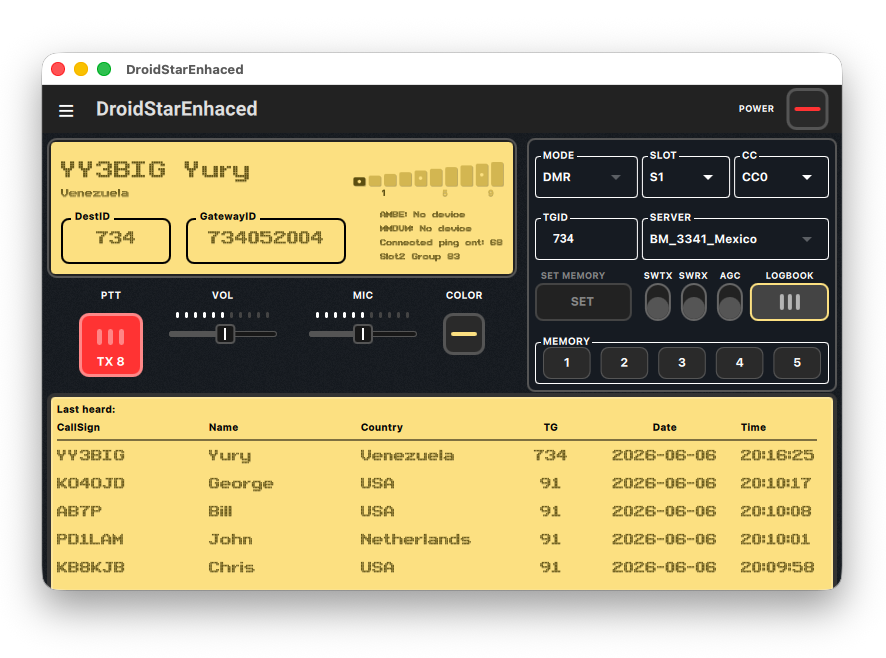

# DroidStarEnhaced — Multiplatform Amateur Radio Client

**DroidStarEnhaced** is a modern, cross-platform digital amateur radio client that connects to M17, YSF/FCS, DMR, P25, NXDN, D-STAR (REF/XRF/DCS), and AllStar (IAX2) reflectors and nodes over UDP. It runs natively on macOS (Apple Silicon and Intel), Windows, and Linux, with mobile support for Android and iOS.

This project is a significantly enhanced fork of the original **DroidStar** by Doug McLain ([@nostar](https://github.com/nostar)), rebuilt with a redesigned desktop interface, persistent logging, a refined LCD-style visual language, and a streamlined macOS build pipeline.

<p align="center">
  
</p>

> 📢 **Latest Release:** Version [v1.1.0](https://github.com/yuryja/droidstar-enhanced/releases/tag/v1.1.0) is now available! See the Releases page for details.

---

## Credits & License

- **Original author:** Doug McLain ([@nostar](https://github.com/nostar)) — [DroidStar](https://github.com/nostar/DroidStar)
- **DMR enhancements upstream:** [rohithzmoi/Droidstar-DMR](https://github.com/rohithzmoi/Droidstar-DMR)
- **DroidStarEnhaced fork maintainer:** Yury Jajitzky ([@yuryja](https://github.com/yuryja))

This software is licensed under the **GNU General Public License v2.0 (GPLv2)**. See [LICENSE](LICENSE) for details.

---

## What's New in DroidStarEnhaced

The original DroidStar is a solid engine — DroidStarEnhaced builds on top of it with a focus on usability and visual clarity for desktop users:

### Redesigned Desktop Interface
- Premium **LCD amber screen** with a pixel-art font (ARCADE.TTF) embedded in the QRC resource system
- Smooth **horizontal slider controls** for volume and microphone gain with visual indicator bars
- LCD-style **raised shadow text** for all on-screen data (S-Meter, mode, slot, callsign)
- **Theming system** with 5 selectable color palettes: Amber, Blue, Pink, Pastel Red, Pastel Yellow
- Matching **COLOR and POWER buttons** with visual state feedback

### Logbook Panel
- Toggleable **Last Heard** panel that slides open below the main interface
- Displays the last 5 received stations: Talkgroup (TG), Callsign, Name, Country, Date, Time (with dynamic QML model reactivity and automatic country lookup)
- Column layout optimized for legibility — TG and Date columns centered, Time right-aligned

### Persistent Station Log
- Automatic CSV database at `~/.config/dudetronics/station_log.csv`
- Dedicated Station Log tab with sortable history (newest first)
- Includes Talkgroup (TG) as the first column, with backward compatibility for older 5-column log databases
- Real-time updates to the CSV log file when Talkgroup details are resolved during a transmission
- One-click CSV export to Documents folder, with a confirmation dialog to clear records

### Controls & UX
- **5-Slot Memory Preset System**: Save current configurations (Mode, Host, Slot, CC, TGID) into slots 1-5 by toggling `SET MEMORY` mode, and reload them with a single click (automatically disconnects, updates parameters, and reconnects). Long press clears a slot.
- **Custom Keyboard PTT Shortcut**: Configure any keyboard key as a PTT button in Settings (mapped dynamically via `QKeySequence` names). Suppresses PTT trigger when typing in input fields to avoid interference.
- **SWTX, SWRX, AGC** toggle buttons styled to match the active screen theme
- Physical volume buttons mapped as PTT on mobile (toggle or hold modes)
- ITU callsign prefix parser for automatic country resolution

---

## Supported Protocols

| Protocol | Modes |
|---|---|
| M17 | Voice + SMS (type 0x05 packets) |
| YSF / FCS | DN and VW modes |
| DMR | BrandMeister, DMR+, TGIF and others |
| P25 | Phase 1 |
| NXDN | Voice |
| D-STAR | REF, XRF, DCS reflectors |
| AllStar | IAX2 client + Web Transceiver mode |

AMBE hardware support: ThumbDV, DVstick 30, DVSI, and any compatible USB AMBE device.
MMDVM hotspot and direct modem mode are also supported.

---

## Requirements

| Tool | Version |
|---|---|
| Qt | 6.5 or later (6.8.x recommended) |
| CMake | 3.16 or later |
| Xcode Command Line Tools | (macOS only) |
| Homebrew | (macOS recommended) |

---

## Installation

### macOS — Development Build

Install Qt via Homebrew (recommended for Apple Silicon):

```bash
brew install qt
```

Clone and configure the project:

```bash
git clone https://github.com/yuryja/droidstar-enhanced.git
cd droidstar-enhanced
cmake -B build -DCMAKE_PREFIX_PATH=$(brew --prefix qt)
```

Build and run:

```bash
cmake --build build
open build/DroidStarEnhaced.app
```

The app will open directly. No extra steps needed for local development.

---

### macOS — Production DMG

Use the included packaging script. It handles all steps automatically:

```bash
# 1. Build
cmake --build build

# 2. Run the packaging script
./package_dmg.sh
```

The script (`package_dmg.sh`) handles: `macdeployqt`, QtDBus fix, plugin pruning, transitive dependency scanning, rpath cleanup, README copy, code signing, xattr cleanup, and DMG creation. If any dependency is missing, it aborts with a clear error before creating the DMG.

> **Note:** If you update Qt via Homebrew, update the Qt version path in `package_dmg.sh` accordingly.

---

### Linux

Install Qt6 and required packages:

```bash
# Debian / Ubuntu / Raspberry Pi OS
sudo apt install libqt6* qml6* qt6-*-dev
```

Build:

```bash
git clone https://github.com/yuryja/droidstar-enhanced.git
cd droidstar-enhanced
cmake -B build
cmake --build build
./build/DroidStarEnhaced
```

---

### Windows

Install [Qt 6.x for Windows](https://www.qt.io/download-open-source) using the Qt online installer. Then:

```powershell
cmake -B build -DCMAKE_PREFIX_PATH="C:/Qt/6.x.x/msvc20xx_64"
cmake --build build --config Release
windeployqt build/Release/DroidStarEnhaced.exe
```

---

### Android

A complete Android build requires the Android NDK and SDK. Gradle build files are included in the `android/` directory. Refer to the Qt documentation for [Qt for Android](https://doc.qt.io/qt-6/android.html) for setup details.

---

## Installing on macOS (End Users)

1. Download `DroidStarEnhaced.dmg` from the [Releases](https://github.com/yuryja/droidstar-enhanced/releases) page
2. Open the `.dmg` and drag **DroidStarEnhaced.app** to your **Applications** folder
3. On first launch, if macOS shows *"developer cannot be verified"*:
   - Go to **System Settings → Privacy & Security → Open Anyway**
   - This is a one-time step. The app is not signed with an Apple Developer ID.

---

## Vocoder Plugin

DroidStarEnhaced supports a software vocoder plugin API compatible with the original DroidStar plugin format.

> **Important:** Only use vocoder plugins you are properly licensed to use. No vocoder plugin is included in this repository.

To install a vocoder, add a download URL to the **Vocoder URL** field in Settings and click **Download Vocoder**. The file will be placed in:

- **macOS / Linux:** `~/.config/dudetronics/`
- **Windows:** `%APPDATA%\dudetronics\`

The plugin filename format is: `vocoder_plugin.<platform>.<arch>`

Supported platforms: `linux`, `darwin`, `winnt`, `android`, `ios`  
Supported architectures: `x86_64`, `arm`, `arm64`

---

## Configuration Notes

| Setting | Description |
|---|---|
| **Callsign** | Your valid amateur radio callsign. Required for all modes. |
| **DMR ID** | Your registered DMR ID. Required for DMR connections. |
| **Talkgroup** | For DMR, enter the talkgroup number (e.g. 91 for BrandMeister Worldwide). |
| **MYCALL / URCALL / RPTR1 / RPTR2** | For D-STAR modes. Pre-populated on connect but editable. |
| **IAX Nodes** | Defined in the Hosts tab. Format: `IAX <node> <ip|wt> <port> <user> <pass>` |

---

## Project Structure

```
droidstar-enhanced/
├── core/           # All C++ business logic: DSP, vocoders, network protocols
├── ui/
│   ├── shared/     # Common fonts, textures, and resources
│   ├── desktop/    # QML UI for macOS, Windows, Linux
│   └── mobile/     # QML UI for Android and iOS
├── Info.plist      # macOS bundle metadata
├── CMakeLists.txt  # Cross-platform build configuration
└── Gemini.md       # Internal build notes and packaging roadmap
```

---

## Contributing

Pull requests are welcome. Please keep all code, comments, and commit messages in **English**. This project follows the architecture conventions described in [Gemini.md](Gemini.md).

---

## Support this Project

DroidStarEnhaced is free, open-source software maintained in my spare time. If you find it useful and want to support continued development, improvements, and macOS build maintenance, donations are welcome and greatly appreciated.

**PayPal:** [paypal.me/yuryja](https://paypal.me/yuryja)

I'm also open to collaborating with other developers and ham radio operators who want to contribute features, bug fixes, or support for additional platforms. Feel free to open an issue or pull request on GitHub.

---

*DroidStarEnhaced is built on the shoulders of open-source ham radio software. Special thanks to Doug McLain and all contributors to the DroidStar ecosystem.*
